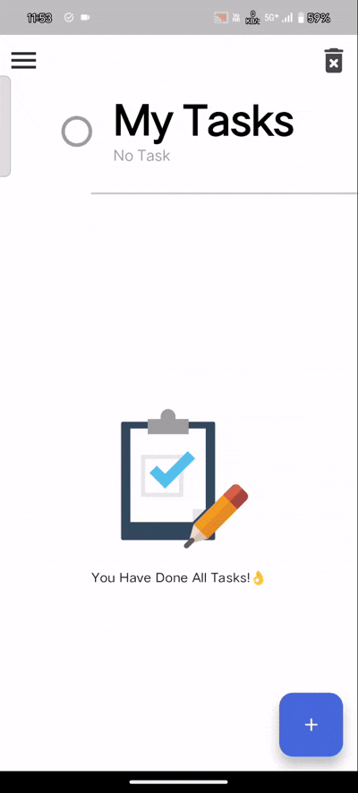
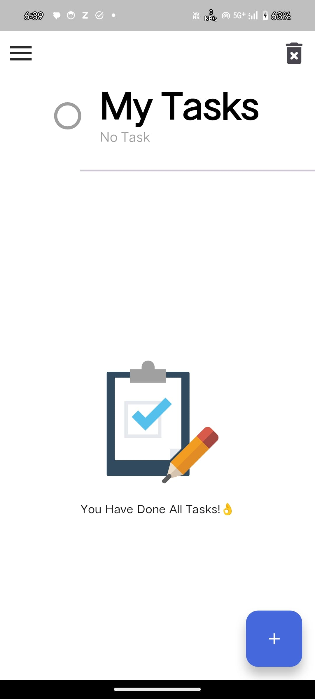
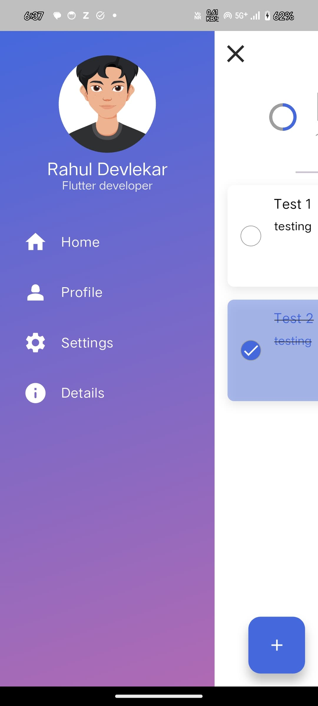
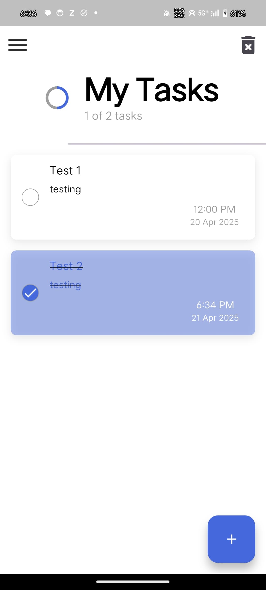
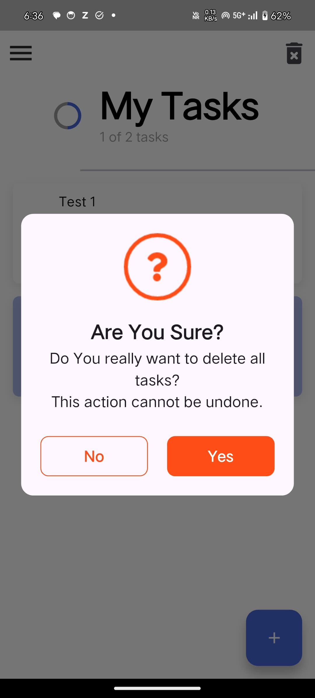
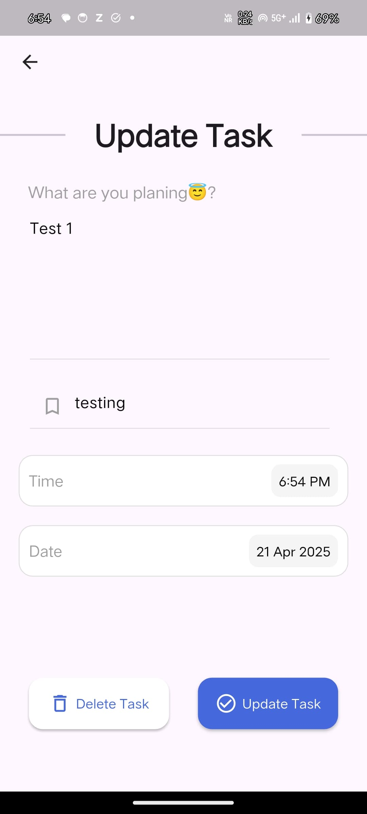

# 📝 To-Do

A clean, gesture-friendly offline to-do list app built with Flutter and Hive.

<p align="center">
  
</p>

## 🚀 Overview
This app is a productivity tool that helps you manage your daily tasks efficiently with gesture-based controls, beautiful animations, and local storage.

## 🌟 Features
- ✅ Add, edit, and delete tasks
- 🗓️ Save due date and time
- 📦 Offline support with Hive database
- 📱 Gesture-based task interaction
- 🎨 Custom animated UI
- 🧭 SliderDrawer for smooth navigation

## 📲 Installation
1. **Clone the Repository**
   ```bash
   git clone https://github.com/sandeshtukrul/todo_flutter.git
   cd todo_flutter
   ```
2. **Install Dependencies**
   ```bash
   flutter pub get
   ```
3. **Run the App**
   ```bash
   flutter run
   ```

## 📱 Platform Support
- ✅ Android

## 📸 Screenshots
<p align="center">
   
   
  
</p>
<p align="center">
    
    
  
</p>

## 🔧 Tech Stack
- **Hive** and **Hive Flutter** for local database storage
- **UUID** for unique task IDs
- **Intl** for date/time formatting and localization
- **Animate Do** and **Lottie** for animations
- **Panara Dialogs** for elegant pop-up dialogs
- **FToast** for displaying toast messages

## 📄 License
This project is licensed under the MIT License. See the [LICENSE](LICENSE) file for details.

## 🤝 Contributing
Pull requests are welcome! Feel free to open issues or submit feature suggestions.

## ⭐ Show Your Support
If you like this project, give it a ⭐ on [GitHub](https://github.com/sandeshtukrul/todo_flutter)!

---
Made with ❤️ by [Sandesh Tukrul](https://github.com/sandeshtukrul)

